# TrustLynx SignBox — User Guide

A complete, illustrated walk‑through of the **TrustLynx SignBox** electronic‑signing
solution: signing in, creating a signing process (with every option explained),
templates, contacts, document profiles, and signing a document with **Smart‑ID** on the
external portal.

> **About this guide.** Every screenshot and step in this manual was produced from the live
> demo environment in June 2026:
> - **Internal portal** — `https://signbox.trustlynx.com` — where you *initiate* and *manage*
>   signing processes.
> - **External (signing) portal** — `https://esign.trustlynx.com` — where recipients
>   *authenticate and sign*.
>
> Personal identity codes and other personal data have been masked in the screenshots.
> In the images, **red boxes and numbered red circles** point to the element each step
> refers to; the numbers match the numbered notes under every picture.

---

## Table of contents

1. [Key concepts & glossary](#1-key-concepts--glossary)
2. [Before you start](#2-before-you-start)
3. [Signing in to the internal portal](#3-signing-in-to-the-internal-portal)
4. [Initiating a signing process](#4-initiating-a-signing-process)
   - [4.1 Upload the document](#41-upload-the-document)
   - [4.2 Choose the document type](#42-choose-the-document-type)
   - [4.3 Add recipients (signers)](#43-add-recipients-signers)
   - [4.4 Roles, identifier and notifications](#44-roles-identifier-and-notifications)
   - [4.5 Anonymous signing (in depth)](#45-anonymous-signing-in-depth)
   - [4.6 Several signers & sequential signing (recipient groups)](#46-several-signers--sequential-signing-recipient-groups)
   - [4.7 Due date](#47-due-date)
   - [4.8 Comments](#48-comments)
   - [4.9 Sign First — the initiator signs first](#49-sign-first--the-initiator-signs-first)
   - [4.10 Start the process](#410-start-the-process)
5. [Templates & Contacts](#5-templates--contacts)
6. [Management — document profiles & attributes](#6-management--document-profiles--attributes)
7. [Signing a document on the external portal](#7-signing-a-document-on-the-external-portal)
   - [7.1 How a signer reaches the portal](#71-how-a-signer-reaches-the-portal)
   - [7.2 Smart‑ID login (external portal)](#72-smart-id-login-external-portal)
   - [7.3 Smart‑ID signing (external portal)](#73-smart-id-signing-external-portal)
   - [7.4 The signed result](#74-the-signed-result)
8. [Tracking processes, statuses, drafts & visibility](#8-tracking-processes-statuses-drafts--visibility)
   - [8.1 History](#81-history)
   - [8.2 Statuses & the Completed vs Finished distinction](#82-statuses--the-completed-vs-finished-distinction)
   - [8.3 Drafts](#83-drafts)
   - [8.4 Process visibility (scope)](#84-process-visibility-scope)
9. [Appendix](#9-appendix)
   - [Authentication & signing methods by country](#authentication--signing-methods-by-country)
   - [Frequently asked questions](#frequently-asked-questions)

---

## 1. Key concepts & glossary

| Term | Meaning |
|------|---------|
| **Process** | A signing workflow: one container of document(s) sent to one or more recipients to sign, approve or view. |
| **Container** | The signed file bundle that SignBox produces (an **ASiC‑E** `.edoc` / `.asice` file holding the original document(s) plus the electronic signatures). |
| **Initiator** | The logged‑in user who creates (starts) a process. |
| **Recipient** | A person added to a process. Each recipient has a **role**. |
| **Recipient group** | A set of recipients that act *together*. Multiple groups sign *in order* (sequential signing). |
| **Role** | What a recipient does: **Signer** (signs), **Approver** (approves without signing), **Viewer** (can only view). |
| **Document profile / Document type** | A pre‑defined template of settings (and optional custom attributes / e‑seal) chosen when creating a process. |
| **Smart‑ID** | A mobile e‑identity app used to authenticate and sign. Confirmation always happens on the user's phone with a PIN. |
| **PIN1 / PIN2** | Smart‑ID PINs: **PIN1** authenticates (logs you in); **PIN2** signs. |
| **QES** | *Qualified Electronic Signature* — the highest legal level of e‑signature in the EU. |
| **XAdES‑LT** | Signature format with a timestamp and long‑term validation data (LT = Long‑Term). |
| **Anonymous recipient** | A recipient who is **not** bound to a personal code in advance; their identity is captured from the Smart‑ID/eID they use at signing time. |

---

## 2. Before you start

- **Internal portal** (`signbox.trustlynx.com`) — for people who *send* documents for signing.
  You sign in with a **username/email and password**.
- **External portal** (`esign.trustlynx.com`) — for people who *sign*. They authenticate with
  a national e‑ID such as **Smart‑ID**, **Mobile‑ID**, **eParaksts**, **ID‑card**, or a bank.
- A modern browser (Chrome, Edge, Firefox, Safari).
- To **sign**, you need a working e‑ID. This guide uses **Smart‑ID**, so you need the Smart‑ID
  app installed and active on your phone.
- The interface language can be switched with the **language selector** (e.g. `EN`) in the
  top‑right corner of either portal.

---

## 3. Signing in to the internal portal

Open `https://signbox.trustlynx.com`. You are redirected to the SignBox sign‑in page.

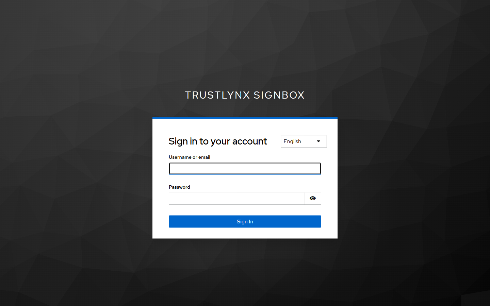

***SignBox sign‑in page — enter your username or email and password, then click **Sign In**.***

1. Enter your **Username or email**.
2. Enter your **Password** (use the eye icon to reveal it).
3. Click **Sign In**.

After signing in you land on the **Home** page, which is also the **Create new process** page.

---

## 4. Initiating a signing process

The **Home** page *is* the process‑creation form. The top navigation bar gives access to every
area of the portal.

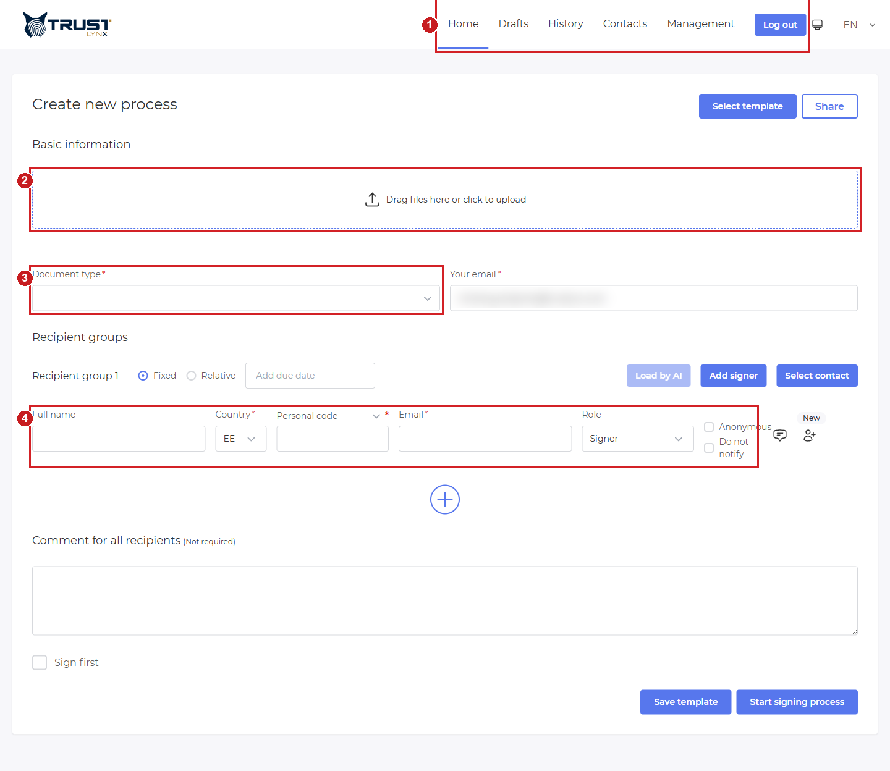

***The Home page doubles as the "Create new process" form.***

1. **Navigation bar** — **Home** (create a process), **Drafts**, **History**, **Contacts**,
   **Management**, and **Log out**.
2. **Upload area** — drag a file here or click to choose one.
3. **Document type** — the document profile (required).
4. **Recipient group 1** — where you add the people who must sign.

### 4.1 Upload the document

Click the **upload area** ("*Drag files here or click to upload*") and pick a PDF (or other
supported file). After upload, SignBox adds the container settings:

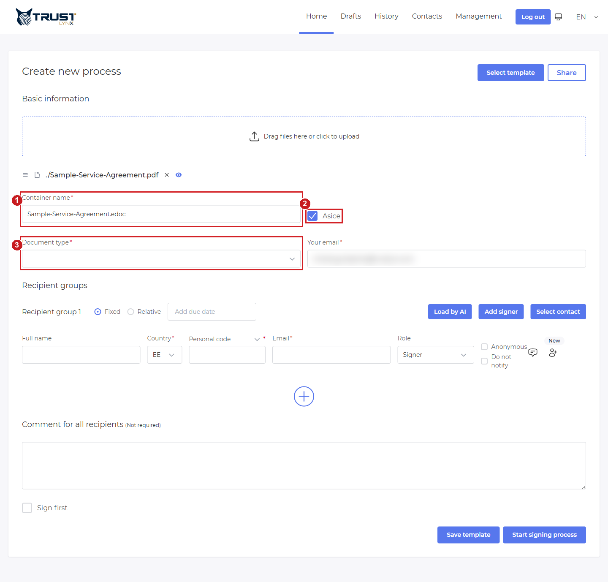

***After uploading, the container name and format appear.***

1. **Container name** — auto‑filled from the file name; it becomes the signed `.edoc` container
   name. You can rename it.
2. **Asice** — the container format (ASiC‑E). Leave it ticked unless told otherwise.
3. **Document type** — still required; choose it next.

### 4.2 Choose the document type

Click the **Document type** field to open the list of available document profiles and pick one
(for example **Customer contract**).

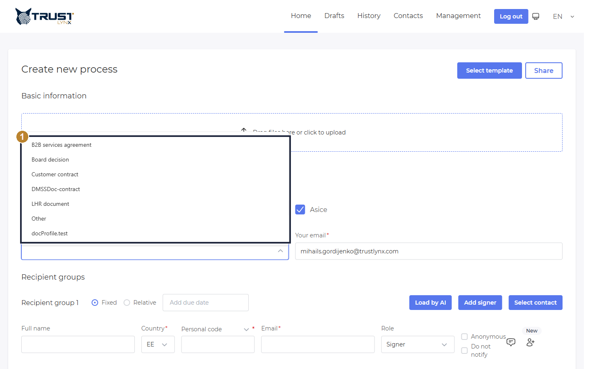

***Choose a document type (profile). The list is managed under **Management → Document profiles**.***

1. The available document types — e.g. *B2B services agreement, Board decision,
   Customer contract, DMSSDoc‑contract, LHR document, Other*.

### 4.3 Add recipients (signers)

Each process has at least one **Recipient group**. Fill in the first recipient's details.
For a Signer identified by personal code you provide: **Full name**, **Country**,
**Personal code**, **Email** and **Role**.

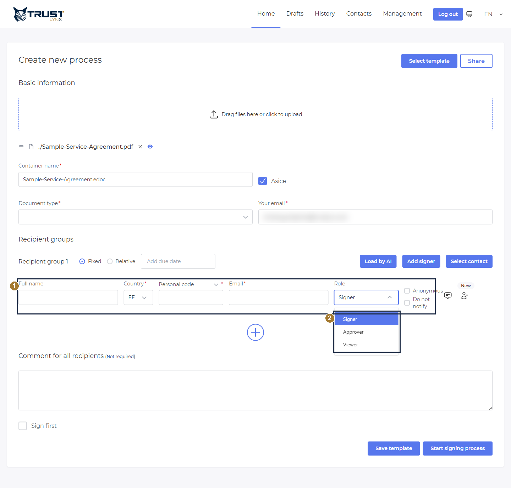

***Fill in the recipient and pick their role.***

1. **Recipient fields** — Full name, Country (EE / LV / LT / PL), the identifier, Email and Role.
2. **Role** — **Signer** (signs the document), **Approver** (approves it without signing) or
   **Viewer** (can only view it).

> The **Email** is always required. It is the address the signing invitation is sent to.

### 4.4 Roles, identifier and notifications

The recipient can be identified by **Personal code** or by **Phone number** (e.g. for Mobile‑ID).
Use the small dropdown next to the identifier field to switch between them.

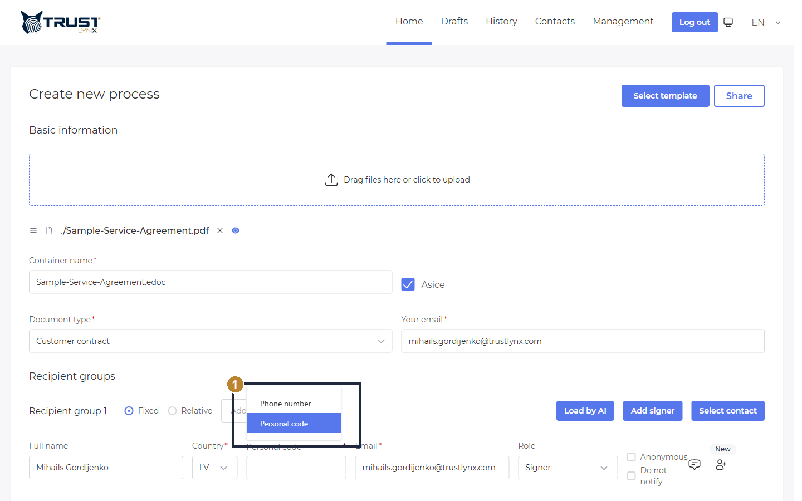

***Choose how the recipient is identified — by **Personal code** or **Phone number**.***

1. **Identifier type** — *Personal code* (for Smart‑ID / ID‑card) or *Phone number* (for Mobile‑ID).

Two per‑recipient switches sit at the end of the row:

- **Anonymous** — see [4.5](#45-anonymous-signing-in-depth).
- **Do not notify** — when ticked, SignBox does **not** send this recipient an email invitation
  (use it when you will share the link another way).

### 4.5 Anonymous signing (in depth)

The **Anonymous** toggle (tooltip *"Share Document Anonymously"*) lets you invite a signer
**without binding them to a specific personal code in advance**. When you turn it on, the
**Country** and **Personal code** fields disappear from the recipient row:

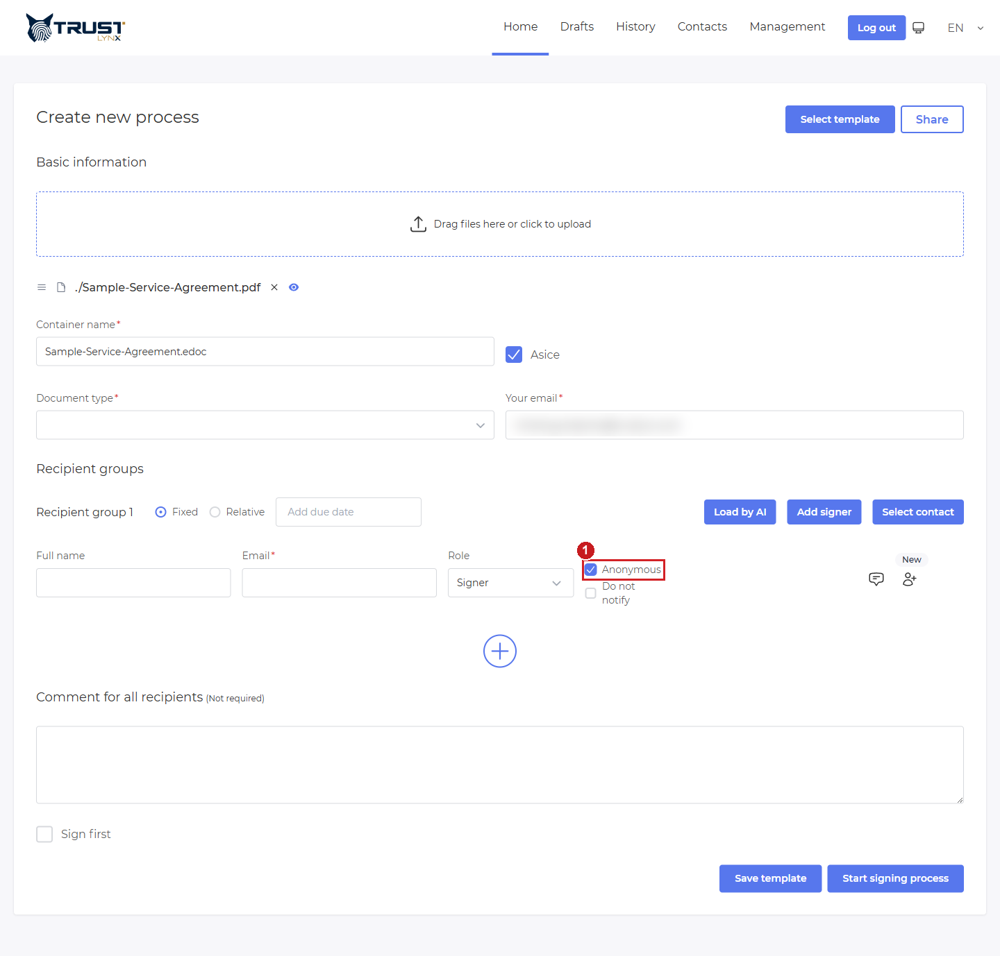

***With **Anonymous** on, no identity (country / personal code) is required up‑front.***

1. **Anonymous** ticked — only **Full name**, **Email** and **Role** remain.

**What it means:**

- **No identity pre‑check.** You do not have to know the signer's personal code. The signer's
  real identity is captured **at signing time** from whatever Smart‑ID / eID they authenticate
  with on the external portal.
- **Who can sign.** Anyone who opens the signing link can authenticate and sign; their captured
  identity is recorded in the signature.
- **Use it when** you don't have (or don't want to enter) the signer's personal code, or for
  "sign by link" scenarios.
- **Behaviour note.** Because an anonymous recipient is not matched to a named slot, the process
  can still show **Started (0/1)** in History even after a valid signature has been added to the
  container — the signature is cryptographically valid, but the workflow slot is not auto‑closed.
  For strict completion tracking, use a **named** recipient (with personal code) instead.

### 4.6 Several signers & sequential signing (recipient groups)

- **Several signers at the same time (parallel):** click **Add signer** inside a group to add
  another recipient to *that* group. Everyone in the same group can sign in any order, in parallel.
- **Sequential signing (one after another):** click the **+** below a group to add **another
  recipient group**. Group 2 is only invited **after** Group 1 has completed. This enforces a
  signing order.

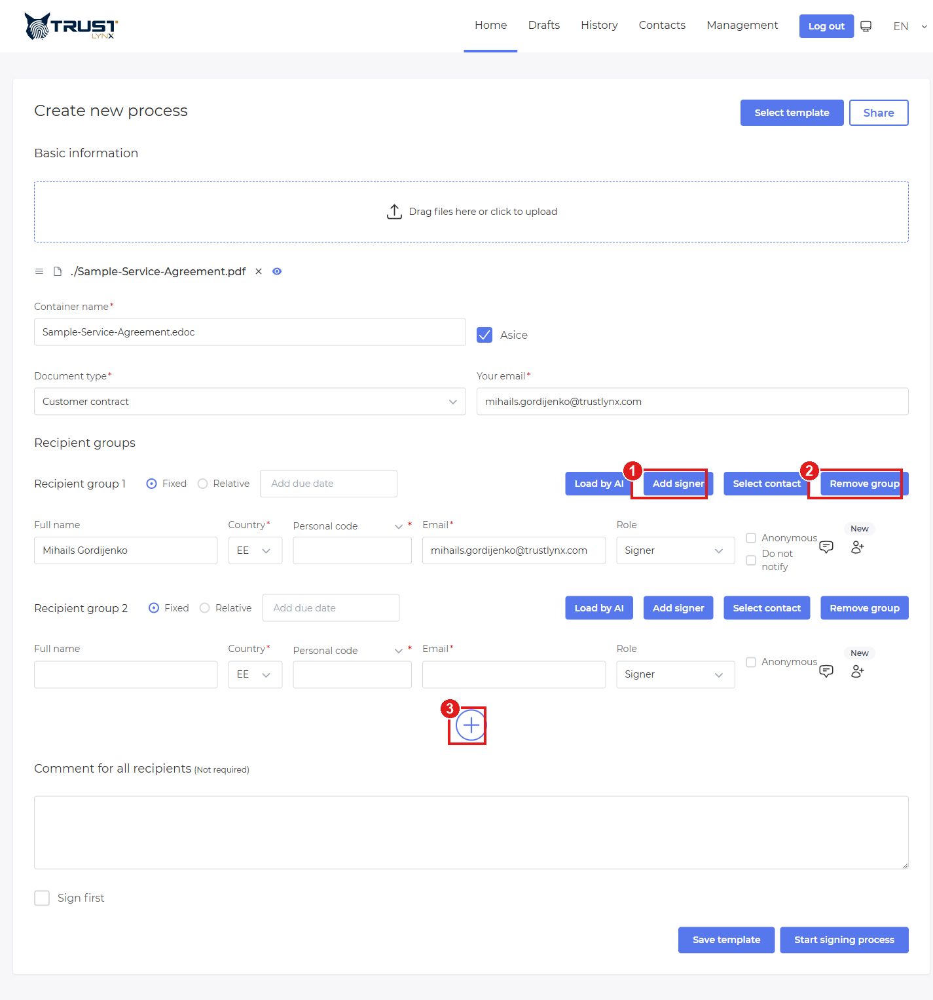

***Two recipient groups = sequential signing (Group 1 signs, then Group 2).***

1. **Add signer** — add another recipient to the *same* group (they sign in parallel).
2. **Remove group** — delete this recipient group.
3. **+ (add another recipient group)** — adds the next group, which signs *after* the previous one.

### 4.7 Due date

Each group can have a **due date**. Choose **Fixed** (a calendar date/time) or **Relative**
(a number of days), then set the value in the **Add due date** field.

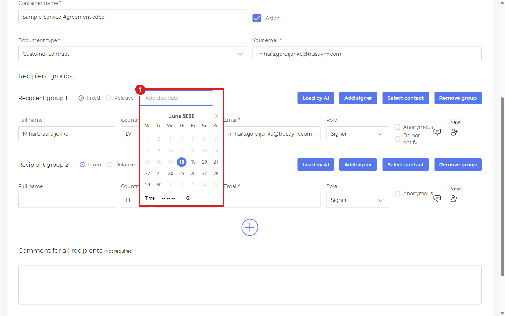

***Set an optional deadline per recipient group (Fixed date or Relative number of days).***

1. The **due‑date picker** — pick a date (and time). Leave empty for no deadline.

### 4.8 Comments

- **Comment for all recipients** — an optional message shown to every recipient (the large text
  box near the bottom of the form).
- **Per‑recipient comment** — click the **speech‑bubble icon** next to a recipient to add a
  comment *just for that person*, and to set the **E‑Mail language** of their invitation.

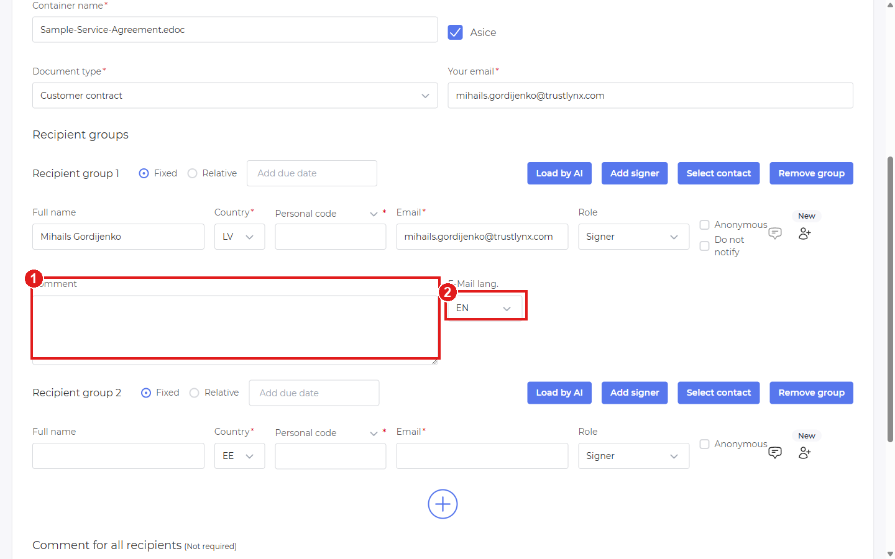

***A per‑recipient comment with its own E‑Mail language.***

1. **Comment** — text shown only to this recipient.
2. **E‑Mail lang.** — the language of this recipient's email invitation.

### 4.9 Sign First — the initiator signs first

Tick **Sign first** (bottom‑left of the form) when **you, the initiator, must sign the document
first**, before any recipient is invited.

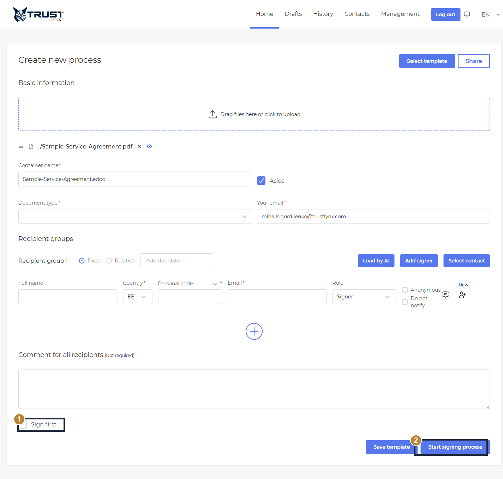

***Enable **Sign first** to sign the document yourself before recipients are invited.***

1. **Sign first** — when ticked, after you start the process you are immediately taken to the
   signing screen to sign first (the same Smart‑ID signing flow described in
   [section 7](#7-signing-a-document-on-the-external-portal)). Only after your signature are the
   recipients notified.
2. **Start signing process** — launches the process.

- **Without Sign first:** recipients are invited immediately when you start the process.
- **With Sign first:** you sign first → then the recipients are invited.

### 4.10 Start the process

Click **Start signing process**. SignBox creates the process and sends invitations.

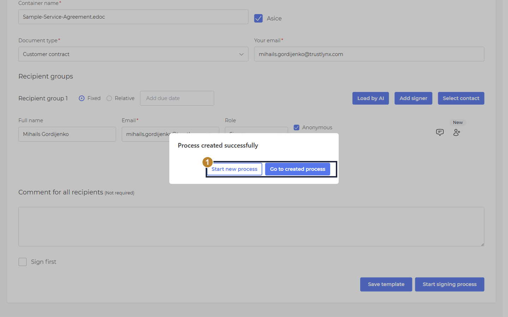

***Confirmation that the process was created.***

1. **Go to created process** — open the new process to track it or to sign it yourself.

> Prefer to finish later? Use the form's **Save template** (to reuse the setup) — see
> [section 5](#5-templates--contacts) — or open the **Drafts** tab to work with unstarted
> processes (see [8.3](#83-drafts)).

---

## 5. Templates & Contacts

### Templates

Templates save a whole process setup (document type, recipients, roles, comments…) so you can
reuse it for recurring workflows.

- **Save a template:** click **Save template** on the create‑process form, give it a **Name**,
  and choose a **Scope**.

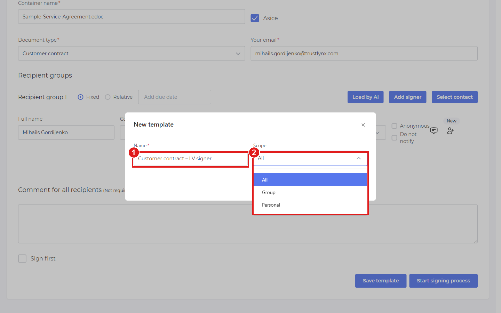

***Saving a template — name it and choose who can use it.***

1. **Name** — the template name.
2. **Scope** — **Personal** (only you), **Group** (your team), or **All** (everyone).

- **Use a template:** click **Select template** (top of the create‑process form), search/filter
  by name and scope, then pick a template to pre‑fill the form.

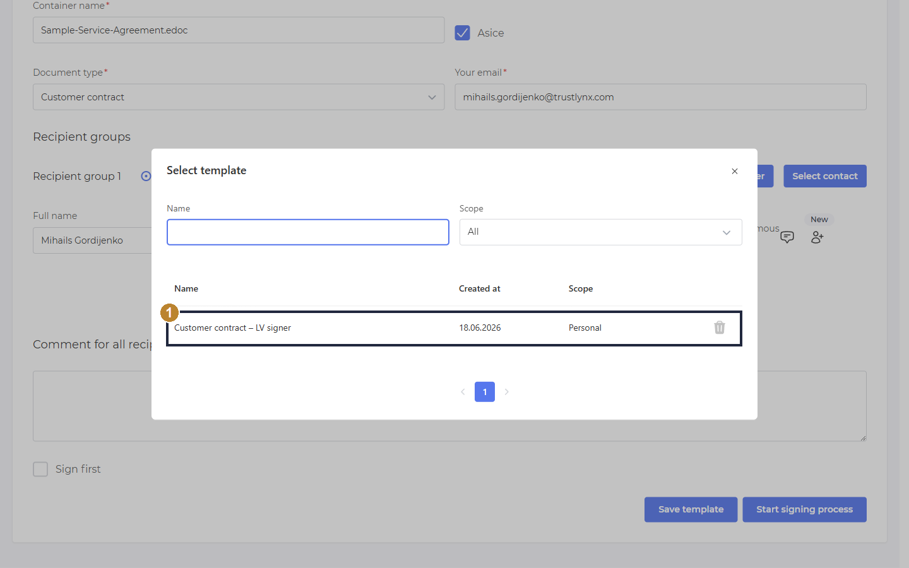

***Loading a saved template pre‑fills the create‑process form.***

1. **Saved template row** — click it to load it; the trash icon deletes it.

### Contacts

**Contacts** are reusable recipients. On the create‑process form, **Select contact** lets you
pick a saved contact instead of typing their details. Manage the list from the **Contacts** tab.

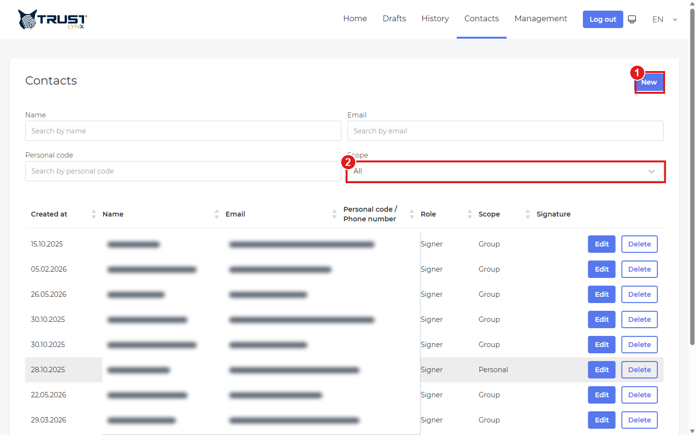

***The Contacts directory — reusable recipients.***

1. **New** — add a contact (name, email, personal code / phone, role, scope, optional signature).
2. **Filters** — search by name, email, personal code, and by **Scope** (Personal / Group / All).

> *In the screenshot the Name, Email and Personal‑code columns are masked for privacy; in the
> product they show the contact's real details.*

---

## 6. Management — document profiles & attributes

The **Management** area (admin) defines the building blocks used when creating processes.

**Document profiles** are the entries that appear in the **Document type** dropdown. Each profile
has an owner group, an optional set of custom attributes, and an optional **E‑Seal** setting.

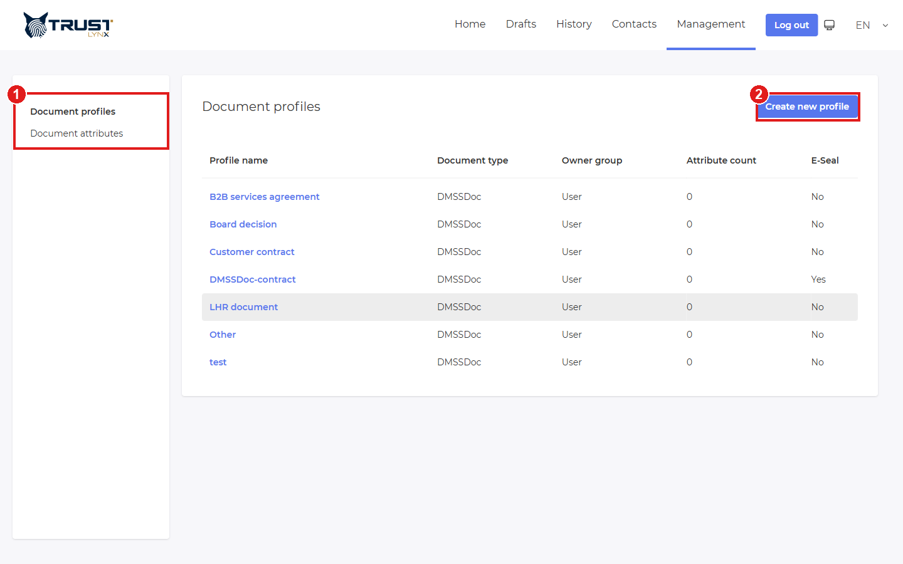

***Document profiles populate the "Document type" choices.***

1. **Sidebar** — switch between **Document profiles** and **Document attributes**.
2. **Create new profile** — add a new document type.

**Document attributes** are custom fields that can be attached to a document profile (each has a
name, a type, and a *required* flag).

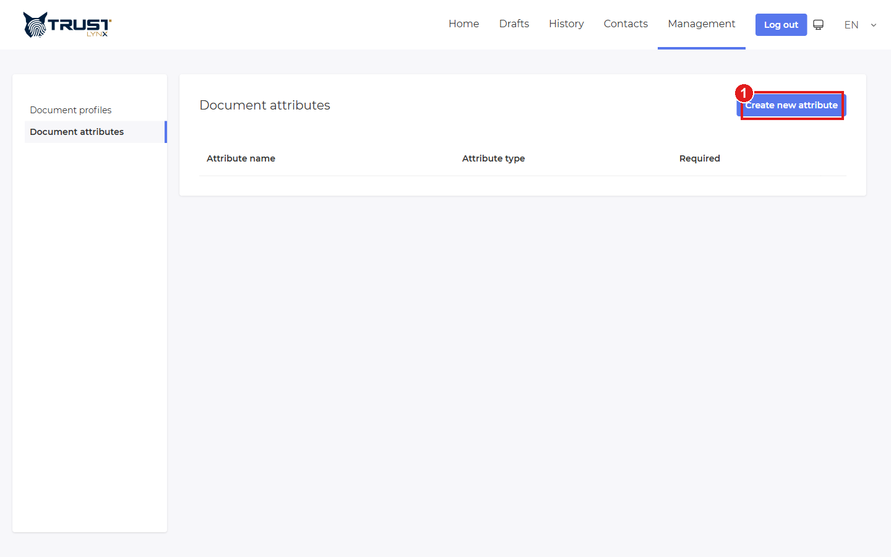

***Custom attributes that can be attached to document profiles.***

1. **Create new attribute** — define a custom field (name, type, required).

---

## 7. Signing a document on the external portal

Signing always happens on the **external portal** (`esign.trustlynx.com`), where the signer
authenticates with their e‑ID and signs. This section shows the **Smart‑ID** flow end‑to‑end.

### 7.1 How a signer reaches the portal

A recipient reaches the signing portal in one of two ways:

- **By email invitation** — they click the link in the "invitation to sign" email and land on the
  external portal's authentication screen (described in [7.2](#72-smart-id-login-external-portal)).
- **From the internal portal** — the initiator (or a signer who is also a SignBox user) opens the
  process and clicks **Sign**, which redirects to the external signing portal.

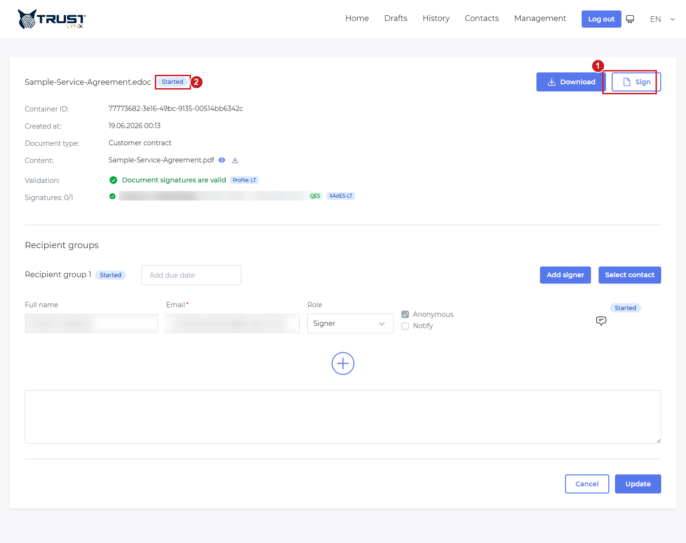

***Opening a process — **Sign** takes you to the external signing portal.***

1. **Sign** — start signing this document on the external portal.
2. **Status badge** — the current process status (here, *Started*).

### 7.2 Smart‑ID login (external portal)

When a signer opens the portal fresh (via the email link), they must **authenticate first**. The
portal shows **"Please Authorize"** with a row of country tabs; under each country are the
available e‑ID methods.

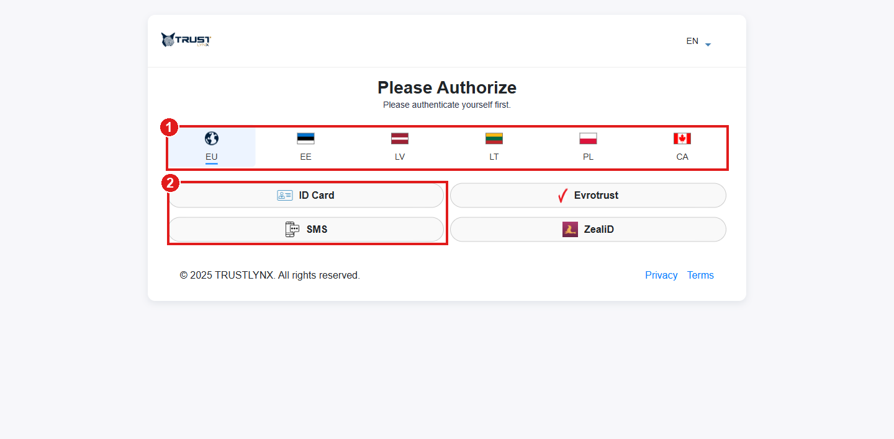

***The external portal authentication screen — pick your country, then a method.***

1. **Country tabs** — **EU**, **EE**, **LV**, **LT**, **PL**, **CA**. Pick the one that matches
   your e‑ID.

Select your country (e.g. **EE**) to reveal that country's methods, then choose **Smart‑ID**:

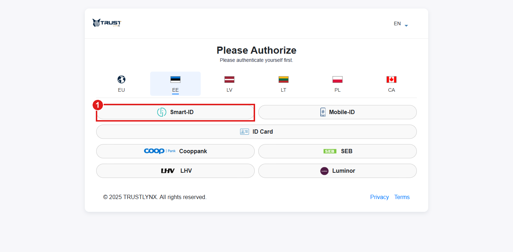

***Each country shows its own methods; choose **Smart‑ID**.***

1. **Smart‑ID** — the method this guide uses.

Smart‑ID then shows a **QR code** *and* a **Personal ID‑code** field. Either scan the QR with the
Smart‑ID app, **or** type your personal code and click **Authenticate**:

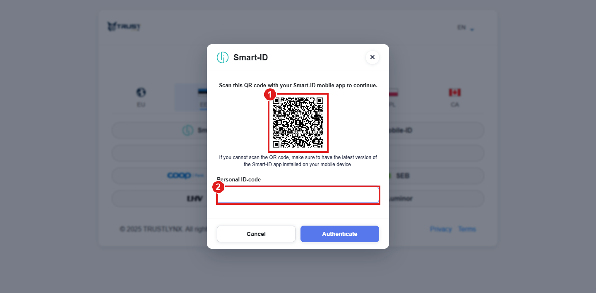

***Authenticate with Smart‑ID — scan the QR **or** enter your personal code.***

1. **QR code** — scan it with the Smart‑ID app on your phone.
2. **Personal ID‑code** — alternatively, type your code and click **Authenticate**.

You then **confirm on your phone**: open the Smart‑ID app, check that the code matches, and enter
your **PIN1**. You are now logged in and can open the document to sign.

### 7.3 Smart‑ID signing (external portal)

On the document signing screen, click **Sign** (top‑right). The portal asks you to **choose a
signing method** by country:

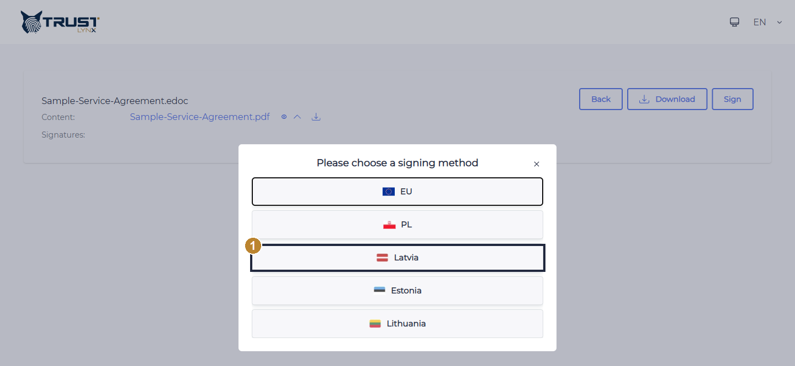

***Choose the country whose e‑ID you will sign with.***

1. **Country** — EU / PL / **Latvia** / Estonia / Lithuania (and others). Pick yours.

Latvia expands to show its signing methods; choose **Smart‑ID**:

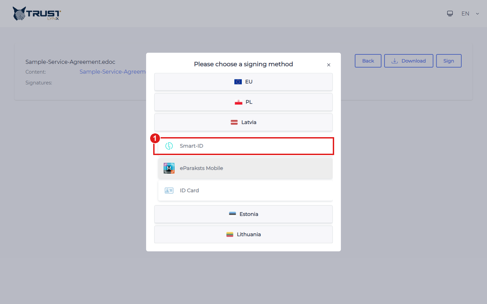

***Latvia's signing methods — Smart‑ID, eParaksts Mobile, ID Card.***

1. **Smart‑ID** — the signing method.

The Smart‑ID dialog appears. You can **enter your personal code** and click **Send data**, or
click **Scan QR code** to sign by scanning instead:

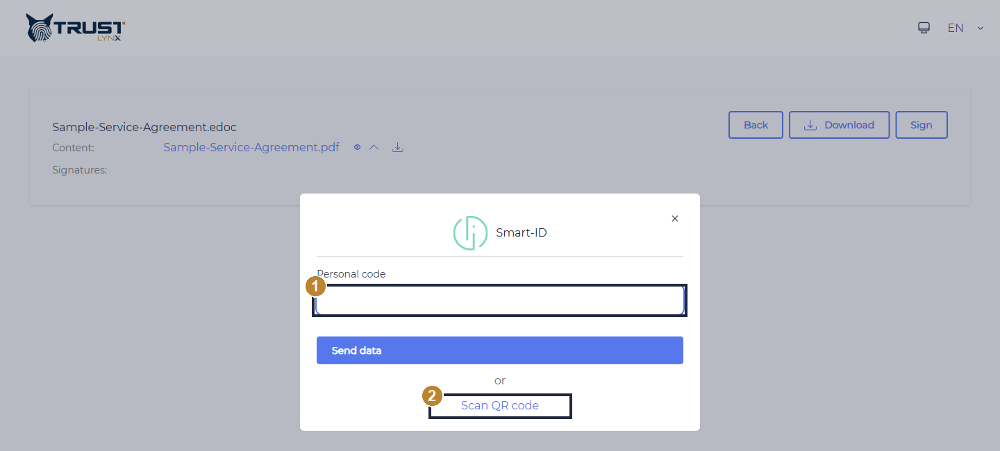

***Start the signature — enter your personal code, or use **Scan QR code**.***

1. **Personal code** + **Send data** — sends the signing request to your phone.
2. **Scan QR code** — sign by scanning the QR with the Smart‑ID app instead of typing a code.

If you choose the QR option, a QR code with a short timer is shown — scan it with the Smart‑ID app:

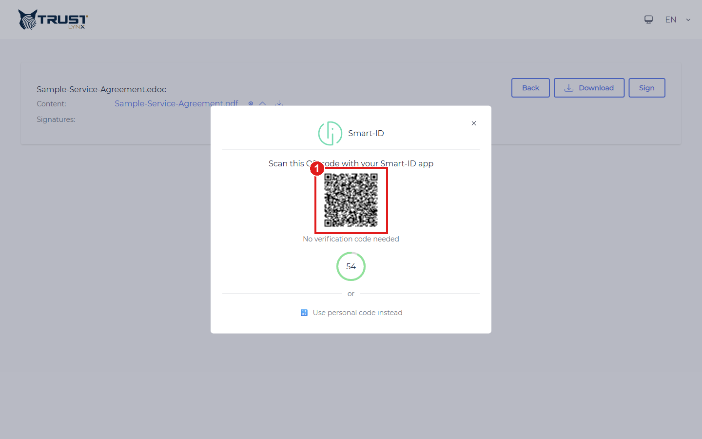

***Scan this QR with the Smart‑ID app (it refreshes on a timer).***

1. **QR code** — scan it with the Smart‑ID app.

A **verification code** then appears on screen. **On your phone**, open the Smart‑ID app, check
that the code shown there matches the one on screen, and enter your **PIN2** to sign:

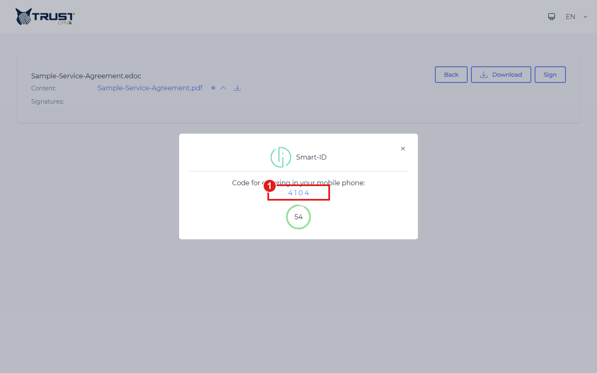

***Match this code in the Smart‑ID app, then enter **PIN2** on your phone to sign.***

1. **Verification code** — confirm this exact number in the Smart‑ID app, then enter PIN2.

### 7.4 The signed result

Once you approve on your phone, the document is signed. The portal confirms the signature is valid
and shows the signer with the signature level:

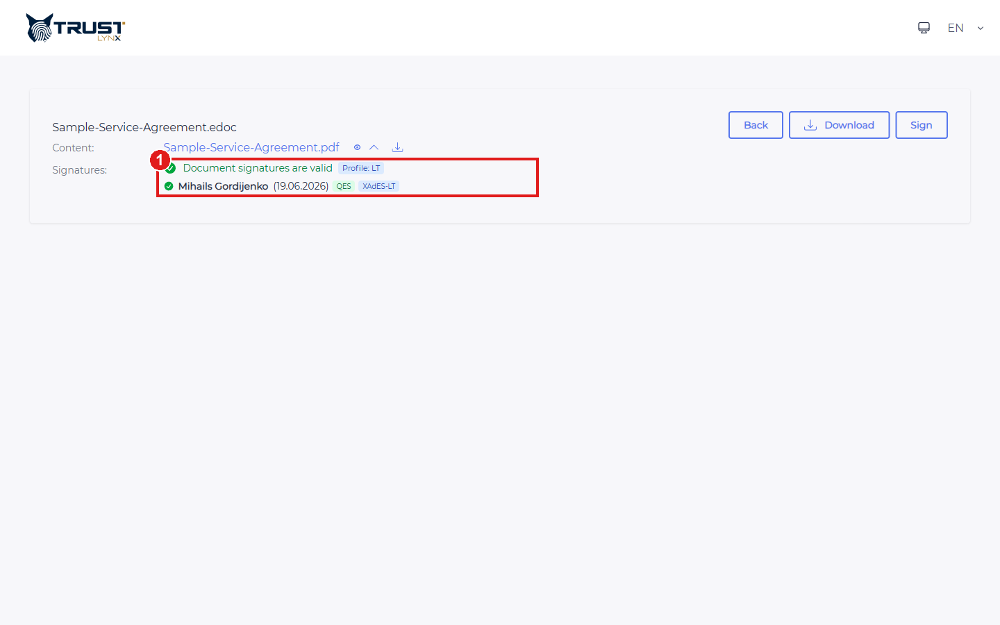

***Signature complete — the document signatures are valid.***

1. **Signatures valid** — *"Document signatures are valid"* with **Profile: LT**, the signer's
   name and date, and the **QES** (Qualified Electronic Signature) and **XAdES‑LT** badges.

The signed container can be downloaded from the portal (**Download**) or from the process details
in the internal portal.

---

## 8. Tracking processes, statuses, drafts & visibility

### 8.1 History

The **History** tab lists your processes. Filter by container name, initiator, **status**, date
**period**, and **document type**. The **Status** column shows each process's state and the
signed/total count (e.g. *0/1*, *1/1*).

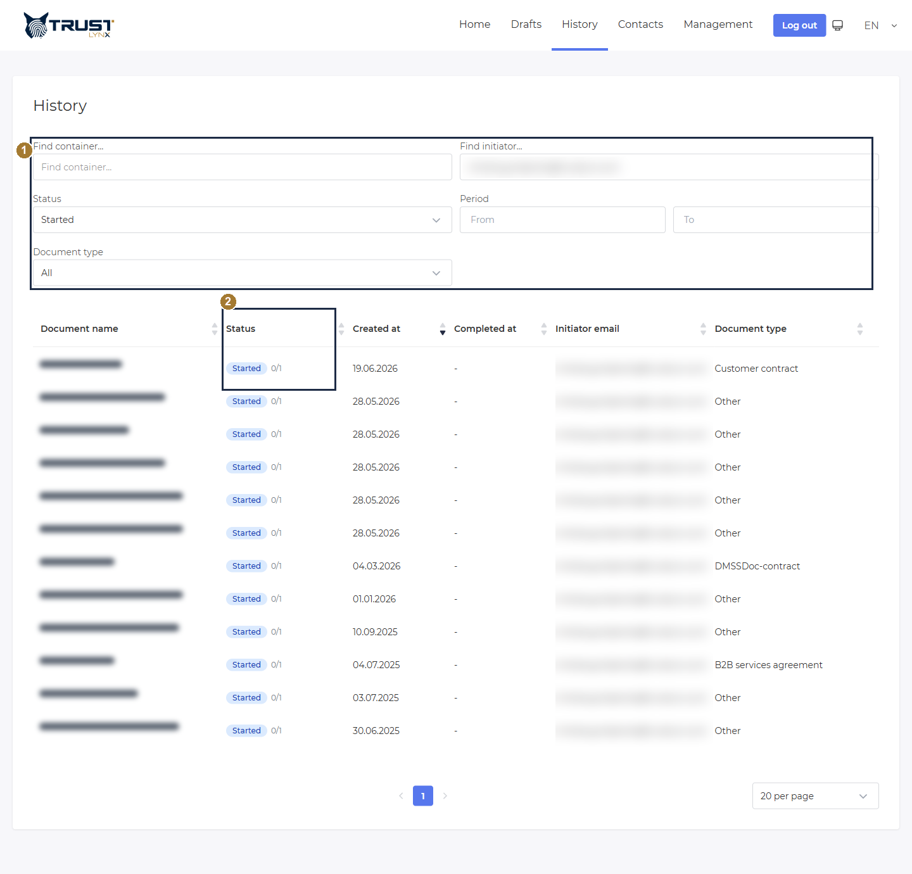

***History — filter and track all your processes.***

1. **Filters** — Find container, Find initiator, **Status**, **Period**, **Document type**.
2. **Status column** — the live status of each process (with the signed/total counter).

Click any row to open the **process details** (container ID, content preview/download, validation,
signatures, recipient groups and their statuses).

### 8.2 Statuses & the Completed vs Finished distinction

Open the **Status** filter to see all process states:

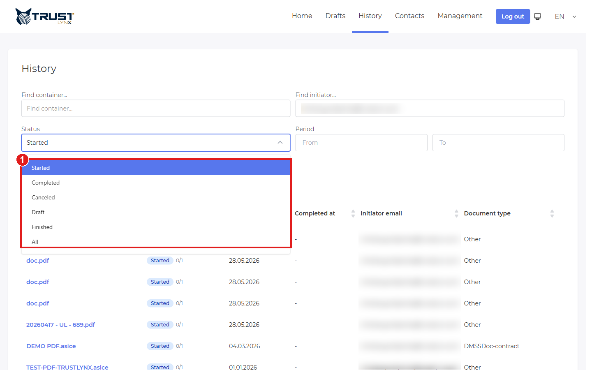

***All process statuses you can filter by.***

1. **Statuses** — **Started**, **Completed**, **Canceled**, **Draft**, **Finished**, **All**
   (plus *Pending*, *Signed*, *Approved* and *E‑Sealed* used internally).

**Status meanings**

| Status | Meaning |
|--------|---------|
| **Draft** | Saved but **not started** — no invitations sent yet. |
| **Started** | In progress — waiting for one or more recipients to act. |
| **Completed** | **All recipients have signed** — every required signature has been collected. |
| **Finished** | The process has been **closed / finalised** (terminal) — the signed container is final. |
| **Canceled** | The process was cancelled. |

**Completed vs Finished — how the process view differs.** Inside a process these two operate at
different levels:

- a **recipient group** shows **Completed** once everyone in that group has signed;
- the **whole process** shows **Finished** once it has been closed/finalised.

The screenshot below is a **Finished** process. Note the three different badges and the **Complete**
action:

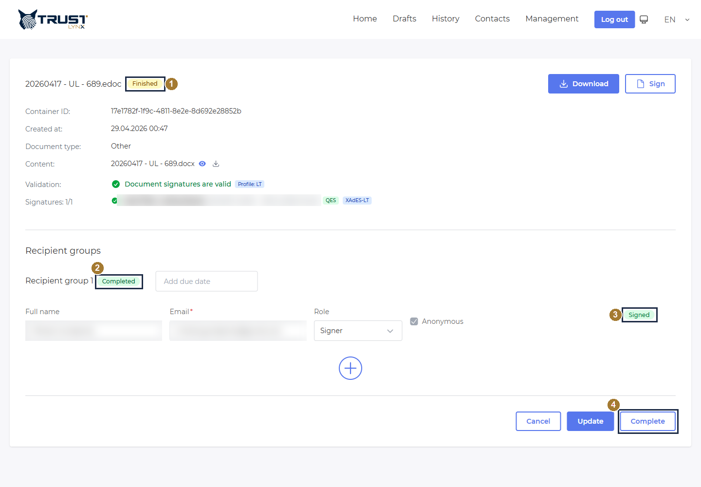

***A finished process — process = **Finished**, group = **Completed**, recipient = **Signed**.***

1. **Process status = Finished** — the process itself is closed/finalised.
2. **Recipient group = Completed** — every signer in this group has signed.
3. **Recipient = Signed** — this individual recipient has signed (with **QES / XAdES‑LT** and a
   valid‑signatures check shown above).
4. **Complete** — the initiator can manually **Complete** (close) a process. *"This action cannot
   be undone."*

So in practice: **Completed** = all signatures collected; **Finished** = the process is closed and
the validated, signed container is final and downloadable.

### 8.3 Drafts

The **Drafts** tab is the History view pre‑filtered to **Status: Draft**. Drafts are processes
that have been prepared but **not yet started**, so **no invitations have been sent**. From here
you can reopen a draft to continue editing it, start it, or delete it.

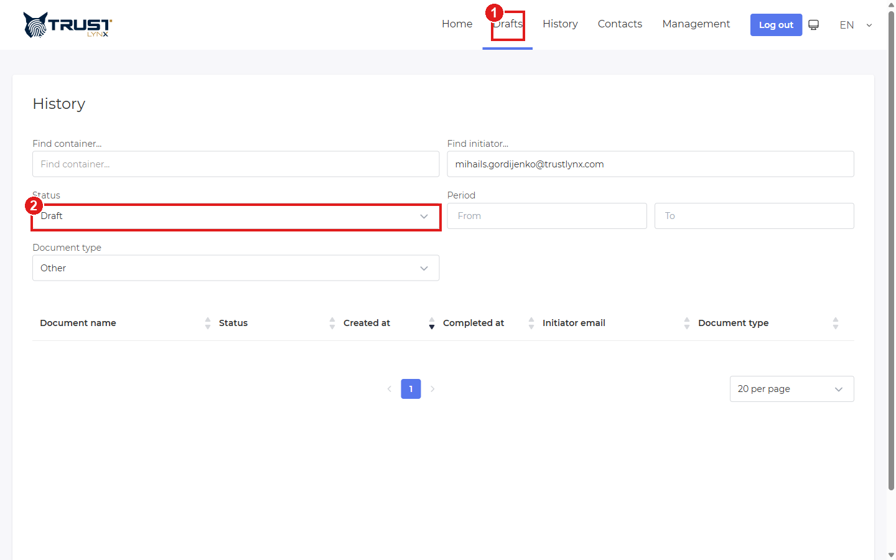

***The Drafts tab lists processes saved but not yet started.***

1. **Drafts** tab — opens History filtered to Draft status.
2. **Status = Draft** — only draft (unstarted) processes are shown.

### 8.4 Process visibility (scope)

Who can see a process, contact or template is governed by **scope** and **owner group**:

- **Personal** — visible only to the owner.
- **Group / Owner group** — visible to the owner's team.
- **All / Global** — visible to everyone.

You set the scope when you save a **template** or **contact** (Personal / Group / All), and each
document profile and process belongs to an **owner group**. The History and Contacts lists show the
items you are allowed to see based on these scopes.

---

## 9. Appendix

### Authentication & signing methods by country

The methods offered on the external portal depend on the selected country. Observed on this
instance:

| Country | Methods |
|---------|---------|
| **EU (generic)** | ID Card (web eID), Evrotrust, SMS, ZealiD |
| **Estonia (EE)** | Smart‑ID, Mobile‑ID, ID Card, Cooppank, SEB, LHV, Luminor |
| **Latvia (LV)** | Smart‑ID, eParaksts Mobile, ID Card |
| **Lithuania (LT)** | Smart‑ID, Mobile‑ID, ID Card (and more) |
| **Poland (PL)** | SimplySign, ZealiD, Evrotrust |

> The exact list per country can be configured per deployment.

### Frequently asked questions

**Do I need a SignBox account to sign?**
No. Signers do not need an internal‑portal account — they authenticate on the external portal with
their e‑ID (Smart‑ID, Mobile‑ID, eParaksts, ID‑card, bank…). Only the **initiator** needs a SignBox
login.

**The Smart‑ID request expired / "Error occurred, please try again later".**
The on‑screen QR/verification code is valid for a short time only. Open the Smart‑ID app first, then
start the request and approve promptly. If it expires, just start the signature again.

**What is the difference between PIN1 and PIN2?**
PIN1 authenticates you (log in); PIN2 creates the signature. The portal always shows a verification
code to match in the app before you enter the PIN.

**What do "QES" and "XAdES‑LT" mean on a signature?**
**QES** is a Qualified Electronic Signature (the strongest legal level in the EU). **XAdES‑LT** is
the signature format with a timestamp and long‑term validation data, so the signature stays
verifiable over time.

**What's the difference between "Add signer" and the "+" button?**
**Add signer** adds another person to the *same* recipient group (they sign in parallel). The **+**
adds a new recipient *group*, which signs only *after* the previous group is done (sequential).

**My document is signed but the process still shows "Started 0/1".**
This happens with **Anonymous** recipients: the signature is valid and in the container, but because
the anonymous signer was not matched to a named slot, the workflow slot isn't auto‑closed. Use a
named recipient (with personal code) if you need the process to move to **Completed** automatically.
